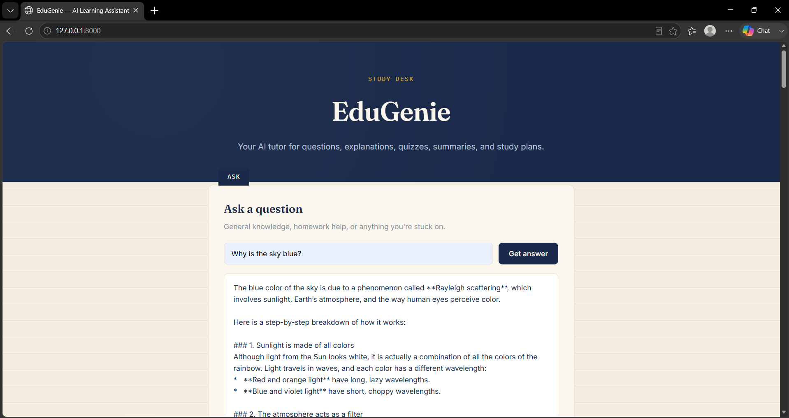

# EduGenie — Google Gemini Powered Learning Assistant

**Live Demo:** [https://edugenie-3.onrender.com](https://edugenie-3.onrender.com)
*(Free-tier hosting — first request after inactivity may take 30–50s to wake up)*

Project built for the **SmartBridge Google Cloud Gen AI Internship**.

## About

EduGenie is an AI-powered learning assistant that helps students learn faster and smarter using generative AI. It combines Google's **Gemini** models for advanced reasoning tasks with a lightweight local **LaMini-Flan-T5** model for quick, simplified concept explanations — giving students a single interface for the most common study tasks:

- **Ask any question** and get a clear, accurate answer
- **Get simplified explanations** of complex topics, written for beginners
- **Generate custom quizzes** from any passage or topic, with instant answer checking
- **Summarize long content** into concise, easy-to-digest text
- **Get a personalized learning path** — structured from beginner to advanced, with curated resources

The interface is designed around a "study desk" concept: each tool sits on its own notebook-style page with a labeled tab, set against a warm parchment background — built to feel calm and legible rather than like a generic dashboard. Built with a modular FastAPI backend, a lightweight vanilla JS/HTML frontend, and deployed live on Render.


## Folder Structure

```
edugenie/
├── docs/
│   ├── screenshots/
│   └── er-diagram/
├── static/
│   └── style.css
├── templates/
│   └── index.html
├── explanation_module.py
├── learning_path.py
├── main.py
├── qna.py
├── quiz_module.py
├── summary_module.py
├── requirements.txt
├── .env.example
└── .gitignore
```

## Setup

1. **Clone the repo & create a virtual environment**
   ```bash
   python -m venv venv
   source venv/bin/activate   # Windows: venv\Scripts\activate
   ```

2. **Install dependencies**
   ```bash
   pip install -r requirements.txt
   ```

3. **Configure your Gemini API key**
   - Copy `.env.example` to `.env`
   - Get a key from [Google AI Studio](https://ai.google.dev/gemini-api/docs/api-key)
   - Add it to `.env`:
     ```
     GEMINI_API_KEY=your_actual_key
     ```

4. **Run the app**
   ```bash
   uvicorn main:app --reload
   ```

5. Open your browser at **http://127.0.0.1:8000**

## API Endpoints

| Method | Endpoint | Description |
|--------|-----------|-------------|
| GET | `/qa?question=...` | Ask a question, answered via Gemini |
| POST | `/explain/` | `{ "topic": "..." }` → simplified explanation |
| POST | `/summarize/` | `{ "text": "..." }` → summary |
| POST | `/quiz` | `{ "text": "..." }` → 3 MCQs (JSON) |
| GET | `/learn/recommendations?topic=...` | Personalized learning path |

## Tech Stack

- **Backend:** FastAPI, Uvicorn
- **AI Models:** Google Gemini (`gemini-flash-latest`, cloud), LaMini-Flan-T5-783M (local, via Hugging Face Transformers)
- **Frontend:** HTML, CSS, Jinja2, vanilla JS (fetch API)
- **Deployment:** Render (Web Service, free tier)

## Screenshots

### Home



## ER Diagram


## Demo Video

[Watch the demo video](docs/demo-video.mp4)

## Notes

- `explanation_module.py` downloads `MBZUAI/LaMini-Flan-T5-783M` from Hugging Face on first run — this may take a few minutes locally, and may not run on memory-constrained free hosting tiers (the app degrades gracefully and other features remain unaffected).
- Gemini model names are periodically deprecated by Google; `gemini-flash-latest` is used as an alias that auto-updates to the current stable flash model to reduce maintenance.
- Free-tier Gemini API usage is subject to daily rate limits (20 requests/day at time of writing for some models).
- Do **not** commit your `.env` file or API key to the repository.